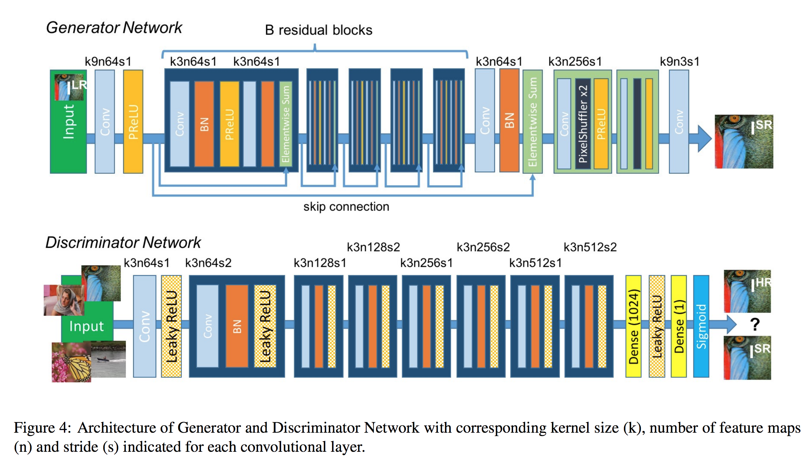

# Neural networks @ FIIT - Project Proposal 🖼
## Organisational:
**Authors:** Martin Tonhauzer, Viktor Valaštín

**Course Supervisor:** Ing. Michal Farkaš

**Academic Year:** 2019/2020, Winter Semester

<!-- 
 - Updated motivation and related work sections from the proposal. // DONE?
 - Dataset and data analysis from the previous submissions. // Almost
 - Description of the neural model architecture. // DONE
 - Description of the training routine.
 - Description of the experiments you conducted.
 - The results of these experiments and their analysis. 
-->

# Image upscaling

## Motivation

You remember those images with really bad resolution since the pixels started to matter? Well now you dont need to fear them anymore!
Jokes aside.
The goal of this project is to create [GAN](https://en.wikipedia.org/wiki/Generative_adversarial_network) to be able to upscale image resolution.
We see huge potential of this technology because we would be able to share images in perfect quality while preserving network bandwidth. 
We see huge potential of this technology in streaming high quality video content while preserving network bandwidth.
You are able to share low resolution image and then upscale it at end device, without noticeable quality loss.

## Related Work
There ares several papers related to image upscaling

 - [Photo-Realistic Single Image Super-Resolution Using GAN](https://arxiv.org/abs/1609.04802)
 - [High-Quality Face Image Super-Resolution Using Conditional GAN](https://arxiv.org/pdf/1707.00737.pdf)

And you can find real world application in:
 - [Ray Tracing upscaling in video games](https://www.nvidia.com/en-us/geforce/news/dlss-control-and-beyond/)
 - [Movie upscaling](https://www.provideocoalition.com/videogorillas-bigfoot-super-resolution-converts-films-from-native-480p-to-4k/)

Also nVidia offers implementation of such use case as part of [NGX](https://developer.nvidia.com/rtx/ngx) package. We might be able to use it as reference when comparing the quality of our model.

## Datasets

Traing neural network for image processing is not easy task which require a lot of images, especially if we use GAN.
We stored all images to our personal [server](http://static.dthi.eu/datasets/) images with links to paths and sources are written below:

- [[div2k/]](http://static.dthi.eu/datasets/div2k/)  **[Source](https://data.vision.ee.ethz.ch/cvl/DIV2K/)**
- [[Flickr2K/]](http://static.dthi.eu/datasets/Flickr2K/) **[Source](http://cv.snu.ac.kr/research/EDSR/Flickr2K.tar)**  
- [[google\_oid/]](http://static.dthi.eu/datasets/google_oid/) (note: only validation sample fully downloaded since whole dataset is 18TB big)  **[Source](https://storage.googleapis.com/openimages/web/index.html)**  

We analyzed the data in datasets in [this jupyter notebook](analyze.ipynb)

## High-Level Solution Proposal
We personally think that our solution will consist couple of steps:

1. Creating dataset:
 - Download a huge images from datasources described above.
 - Crop images to square
 - Downscale them to appropriate dimensions (32x32px)
 - create train, test and verify datasets.
2. Training and engineering the model.
 - Our main inspiration was paper [Photo-Realistic Single Image Super-Resolution Using a Generative Adversarial Network](https://arxiv.org/pdf/1609.04802.pdf) 

## Project Structure

There are many python and other important files in this repository, we provide list with short description to each file:

**Python Files**
 - [create_dataset](create_dataset.py) take list of images crop them to square and resize them to 32x32px images
 - [discriminator](discriminator.py) source code for Discriminator
 - [fetcher](fetcher.py) image dowloader from [Pixabay](https://pixabay.com)
 - [flow](flow.py) split image dataset to batches and run epochs on GAN
 - [gan](gan.py) wrapper for Generator and Discriminator
 - [generator](generator.py) source code for Generator
 - [resizer](resizer.py) Utilities for image processing
 - [main](main.py) console runner for neural network
 - [loss](loss.py) contains definitions of used loss functions
 - [parallel_loader](parallel_loader.py) implements batch generator

**Jupyter Notebooks**
 - [analyze](analyze.ipynb) Jupyter notebook with data analysis
 - [dataset_preparation](dataset_preparation.ipynb) describes preparation of data
 - [model_training](model_training.ipynb) describes how to train model

**Other Files**
 - [requirements](requirements.txt) list of required libraries for pip
 - [milestones](milestones.pdf) list of epochs with results
 - [logs](logs) contains training logs

## Neural Model Architecture

[Credits for pic](https://developers.google.com/machine-learning/gan/gan_structure)

As we know GAN consist of two separated neural networks as we see on the image above.
We insert low-resolution (32x32px) images as input for generator netork which upscales the images in dataset.
On the other hand we insert real (validation) images and also generated image as input for Discriminator network which calculate loss for discriminator and generator,
Then the losses are backpropagated.

Generator network constist of convolution layer (9x9 kernel, 64 feature maps, 1x1 stride), PReLU then 16 residual blocks with skip connection, convolution (3, 64, 1) batch normalization, 2 upsampling blocks, convolution and hyberbolic tangens as activation function.

Discriminator network is built from these layers: convolution (3, 64, 1), 7 residual blocks, dense layer, leaky relu, dense layer and sigmoid as activation function.
On the image below we can see image representation of these networks.

## Training Routine

> We created GAN class to simplify processes

First of all we preprocess images to square and 32x32px resolution (in parrallel mode)
Then for each epoch: 
  - create super resolution (sr) images via generator.predict
  - turn on trainable on discriminator  
  - calculate loss from sr images and from high resolution (hr) images
  - turn off trainable on discriminator  

Whole code can be found for training [here](flow.py)

## Experiments

All the resulting models are described in [this](milestones.pdf) document. We can split our experiments to 3 main milestones:

#### 1. Wasserstein loss

We have [read](https://developers.google.com/machine-learning/gan/loss) that using [Wasserstein loss](https://arxiv.org/abs/1701.07875) is pretty good idea to use with GAN, but we were facing issues with poor image output. 

#### 2. Mean Square Error

Then we used MSE as loss function for generator and binary crossentropy for discriminator. 
In this part we tried two different approaches. In first approach we used small amount of epochs (10) with huge portion of images (50 thousand).
We were able to see edges on the geneated images but they were facing a lot of output noise.
Second approach was complete oposite of the first one. We used 1000 epochs and only 128 images. The idea behind this approach was to "overtrain" the neural network, because we wanted to know if the neural network starts to generate nice images. The result images from this approach have minimal noise but on the other hand it only works for small range of images.

#### 3. VGG 19 loss

Paper proposed new loss function which calculate difference base on features extracted from pre-trained VGG19 model.

## Evaluation

We basically take generated image and visually check with expected output.
Then we discuss about what parts/shapes of image were done correctly.
If we get into point, where we are unable say distinct difference between pictures we use [structural similarity](https://scikit-image.org/docs/dev/api/skimage.metrics.html#skimage.metrics.structural_similarity) to calculate it.

## Future Work

In future work we would like to train on huge amount of images (prevents overtraining) and lot of epochs
